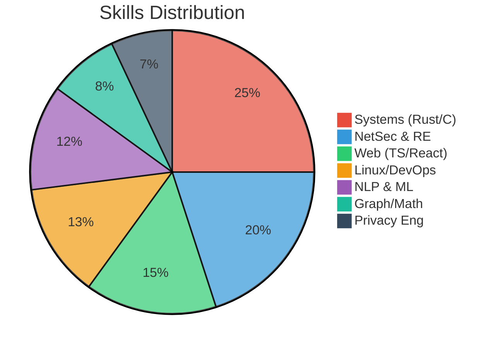
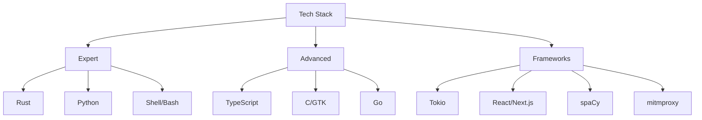
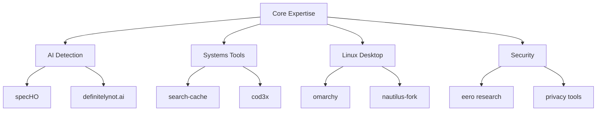

# Resume Mermaid Diagrams

## 1. Skills Distribution

```mermaid
%%{init: {'theme':'base', 'themeVariables': { 'pie1':'#e74c3c','pie2':'#3498db','pie3':'#2ecc71','pie4':'#f39c12','pie5':'#9b59b6','pie6':'#1abc9c','pie7':'#34495e'}}}%%
pie title Skills Distribution
    "Systems (Rust/C)" : 25
    "NetSec & RE" : 20
    "Web (TS/React)" : 15
    "Linux/DevOps" : 13
    "NLP & ML" : 12
    "Graph/Math" : 8
    "Privacy Eng" : 7
```

## 2. Tech Stack Hierarchy

```mermaid
flowchart TD
    A[Tech Stack] --> B[Expert]
    A --> C[Advanced]
    A --> D[Frameworks]

    B --> B1[Rust]
    B --> B2[Python]
    B --> B3[Shell/Bash]

    C --> C1[TypeScript]
    C --> C2[C/GTK]
    C --> C3[Go]

    D --> D1[Tokio]
    D --> D2[React/Next.js]
    D --> D3[spaCy]
    D --> D4[mitmproxy]
```

## 3. Focus Areas Overview

```mermaid
flowchart TD
    Root[Core Expertise] --> A[AI Detection]
    Root --> B[Systems Tools]
    Root --> C[Linux Desktop]
    Root --> D[Security]

    A --> A1[specHO]
    A --> A2[definitelynot.ai]

    B --> B1[search-cache]
    B --> B2[cod3x]

    C --> C1[omarchy]
    C --> C2[nautilus-fork]

    D --> D1[eero research]
    D --> D2[privacy tools]
```
