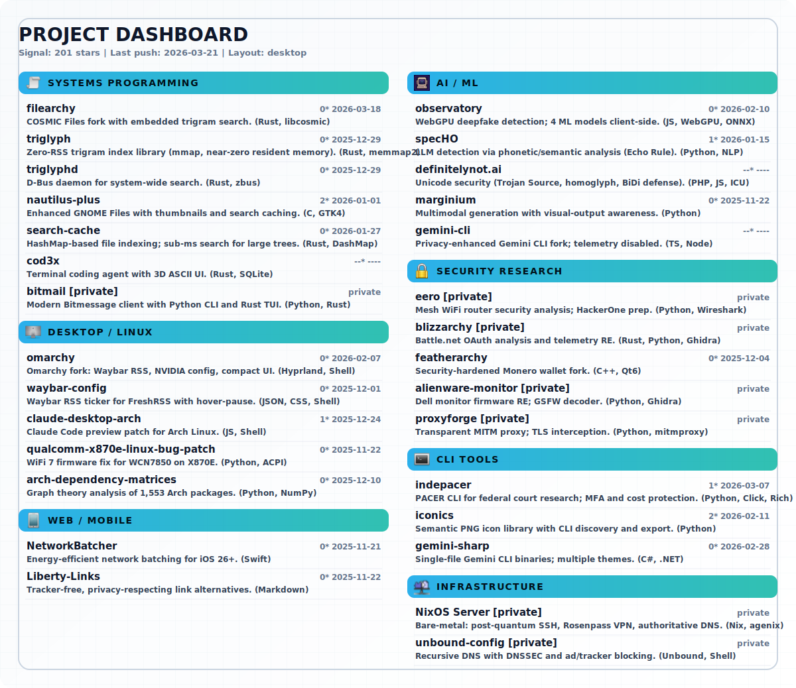

<figure>
  
</figure>
<p align="center">
  <a href="https://definitelynot.ai"></a>&nbsp;
  <a href="https://internetuniverse.org"></a>&nbsp;
  <a href="https://math.berkeley.edu"></a>&nbsp;
  <a href="mailto:webmaster@internetuniverse.org"></a>
</p>
<p align="center">
  <sub>SF Bay Area &ensp;&bull;&ensp; <a href="https://johnzfitch.github.io/johnzfitch">Git Page</a> &ensp;&bull;&ensp; All icons from <a href="https://github.com/johnzfitch/iconics">iconics</a></sub>
</p>

<!-- Link Reference Definitions (Layer 1: invisible metadata) -->

-----

## OpenAI Codex: Finding the Ghost in the Machine

> [!IMPORTANT]
> Solved a <ruby>pre-`main()`<rp>(</rp><rt>⁠#[ctor::ctor]</rt><rp>)</rp></ruby> environment stripping bug causing <mark>11–300× <abbr title="Graphics Processing Unit">GPU</abbr> slowdowns</mark> that eluded OpenAI's debugging team for months. This was the main blocker to Codex spawning and controlling effective subagents. The regression often times caused delayed cpu fallback or silent failures in ML-related tasks across all operating systems.

Proof: [Issue #8945](https://github.com/openai/codex/issues/8945)  |  [PR #8951](https://github.com/openai/codex/pull/8951)  |  [Release notes (<samp>rust-v0.80.0</samp>)](https://github.com/openai/codex/releases/tag/rust-v0.80.0)

<details>
<summary><b>Full Investigation Details</b></summary>

<br>

### The Ghost

In <time datetime="2025-10">October 2025</time>, OpenAI assembled a specialized debugging team to investigate mysterious slowdowns affecting <b>Codex</b>. After a week of intensive investigation: <b>nothing</b>.

The bug was literally a ghost — `pre_main_hardening()` executed before `main()`, stripped critical environment variables (<var>LD_LIBRARY_PATH</var>, <var>DYLD_LIBRARY_PATH</var>), and disappeared without a trace. Standard profilers saw nothing. Users saw variables in their shell, but inside <samp>codex exec</samp> they vanished.

-----

### The Hunt

Within <b>3 days</b> of their announcement, I identified the problematic commit [PR #4521](https://github.com/openai/codex/pull/4521) and contacted <kbd>@tibo_openai</kbd>.

But identification is not proof. I spent <b>2 months</b> building an undeniable case.

#### Timeline

<table>
  <thead>
    <tr>
      <th width="180">Date</th>
      <th>Event</th>
    </tr>
  </thead>
  <tbody>
    <tr>
      <td><time datetime="2025-09-30">Sept 30, 2025</time></td>
      <td><a href="https://github.com/openai/codex/pull/4521">PR #4521</a> merges, enabling <code>pre_main_hardening()</code> in release builds</td>
    </tr>
    <tr>
      <td><time datetime="2025-10-01">Oct 1, 2025</time></td>
      <td><samp>rust-v0.43.0</samp> ships <mark>(first affected release)</mark></td>
    </tr>
    <tr>
      <td><time datetime="2025-10-06">Oct 6, 2025</time></td>
      <td>First &ldquo;painfully slow&rdquo; regression reports</td>
    </tr>
    <tr>
      <td>Oct 1&ndash;29, 2025</td>
      <td>Spike in <var>env</var>/<var>PATH</var> inheritance issues across platforms</td>
    </tr>
    <tr>
      <td><time datetime="2025-10-29">Oct 29, 2025</time></td>
      <td>Emergency <var>PATH</var> fix lands <em>(did not catch root cause)</em></td>
    </tr>
    <tr>
      <td>Late Oct 2025</td>
      <td>OpenAI&rsquo;s specialized team investigates, declares there is no root cause, identifies issue as user behavior change</td>
    </tr>
    <tr>
      <td><time datetime="2026-01-09">Jan 9, 2026</time></td>
      <td><ins>My fix merged, credited in release notes</ins></td>
    </tr>
  </tbody>
</table>

#### Evidence Collected

<table>
  <thead>
    <tr>
      <th>Platform</th>
      <th>Issues</th>
      <th>Failure Mode</th>
    </tr>
  </thead>
  <tbody>
    <tr>
      <td><b>macOS</b></td>
      <td>#6012, #5679, #5339, #6243, #6218</td>
      <td><var>DYLD_*</var> stripping breaking dynamic linking</td>
    </tr>
    <tr>
      <td><b>Linux/<abbr title="Windows Subsystem for Linux 2">WSL2</abbr></b></td>
      <td>#4843, #3891, #6200, #5837, #6263</td>
      <td><var>LD_LIBRARY_PATH</var> stripping &rarr; silent <abbr title="Compute Unified Device Architecture">CUDA</abbr>/<abbr title="Math Kernel Library">MKL</abbr> degradation</td>
    </tr>
  </tbody>
</table>

**Compiled evidence packages:**

<dl>
  <dt>&ensp;Platform-specific failure modes</dt>
  <dd>Reproduction steps with quantifiable performance regressions (11&ndash;300&times;) and benchmarks</dd>
  <dt>&ensp;Pattern analysis</dt>
  <dd>Cross-referenced 15+ scattered user reports over 3 months, traced process environment inheritance through <code>fork</code>/<code>exec</code> boundaries</dd>
</dl>

   [Comprehensive Technical Analysis](https://github.com/user-attachments/files/24510983/GITHUB_ISSUE_DETAILED.md)<br>
   [Investigation Methodology](https://docs.google.com/document/d/1fDJc1e0itJdh0MXMFJtkRiBcxGEFtye6Xc6Ui7eMX4o/edit)

-----

### Why Conventional Debugging Failed

The bug was designed to be invisible:

<dl>
  <dt>Pre-main execution</dt>
  <dd>Used <code>#[ctor::ctor]</code> to run before <code>main()</code>, before any logging or instrumentation</dd>
  <dt>Silent stripping</dt>
  <dd>No warnings, no errors&thinsp;&mdash;&thinsp;just missing environment variables</dd>
  <dt>Distributed symptoms</dt>
  <dd>Appeared as unrelated issues across different platforms and configurations</dd>
  <dt>User attribution</dt>
  <dd>Everyone assumed they misconfigured something (shell looked fine)</dd>
  <dt>Wrong search space</dt>
  <dd>Team was debugging post-<code>main</code> application code</dd>
</dl>


> [!NOTE]
> Standard debugging tools cannot see pre-main execution. Profilers start at `main()`. Log hooks are not initialized yet. The code executes, modifies the environment, and vanishes.

-----

### The Impact

OpenAI confirmed and merged the fix within 24 hours, explicitly crediting the investigation in <samp>v0.80.0</samp> release notes:

> "Codex <abbr title="Command Line Interface">CLI</abbr> subprocesses again inherit env vars like <var>LD_LIBRARY_PATH</var>/<var>DYLD_LIBRARY_PATH</var> to avoid runtime issues. As explained in #8945, failure to pass along these environment variables to subprocesses that expect them (notably <abbr title="Graphics Processing Unit">GPU</abbr>-related ones), was causing 10×+ performance regressions! Special thanks to <kbd>@johnzfitch</kbd> for the detailed investigation and write-up in #8945."

**Restored:**

<table>
  <tbody>
    <tr>
      <td><ins><abbr title="Graphics Processing Unit">GPU</abbr> acceleration</ins></td>
      <td>Internal ML/AI dev teams</td>
    </tr>
    <tr>
      <td><ins><abbr title="Compute Unified Device Architecture">CUDA</abbr>/PyTorch</ins></td>
      <td>ML researchers</td>
    </tr>
    <tr>
      <td><ins><abbr title="Math Kernel Library">MKL</abbr>/NumPy</ins></td>
      <td>Scientific computing users</td>
    </tr>
    <tr>
      <td><ins>Conda environments</ins></td>
      <td>Cross-platform compatibility</td>
    </tr>
    <tr>
      <td><ins>Enterprise drivers</ins></td>
      <td>Database connectivity</td>
    </tr>
  </tbody>
</table>

When the tools are blind, the system lies, and everyone else has stopped looking for it..</details>

-----

## Live Demos

<dl>
  <dt><a href="https://definitelynot.ai"><b>Cosmic Code Cleaner</b></a> @ definitelynot.ai</dt>
  <dd>LLM paste sanitizer with vectorhit algorithm — fix curly quotes, invisible Unicode, confusable punctuation, dedent blocks</dd>

  <dt><a href="https://llm.cat"><b>LLMX Ingestor</b></a> @ llm.cat</dt>
  <dd>WebAssembly codebase indexer — private, deterministic chunking and BM25 search for large folders</dd>

  <dt><a href="https://internetuniverse.org"><b>LINTENIUM FIELD</b></a> @ internetuniverse.org</dt>
  <dd>Terminal-based <abbr title="Alternate Reality Game">ARG</abbr> experience — interactive mystery with audio visualizations</dd>

  <dt><a href="https://look.definitelynot.ai"><b>Observatory</b></a> @ look.definitelynot.ai</dt>
  <dd><abbr title="Web Graphics Processing Unit">WebGPU</abbr> deepfake detection running 4 ML models in browser</dd>
</dl>

-----

## Recent Work

<dl>
  <dt><a href="https://github.com/johnzfitch/claude-cowork-linux"><b>claude-cowork-linux</b></a> <sub>⭐32</sub></dt>
  <dd>Run Claude Desktop's Cowork feature on Linux through reverse engineering and native module stubbing</dd>

  <dt><a href="https://github.com/johnzfitch/grove"><b>grove</b></a></dt>
  <dd>Kanban-style <abbr title="Terminal User Interface">TUI</abbr> for parallel AI coding — manage Git worktrees as tasks, run multiple agents in isolated tmux sessions</dd>

  <dt><a href="https://github.com/johnzfitch/human-interface-markdown"><b>human-interface-markdown</b></a></dt>
  <dd>Apple Human Interface Guidelines archive (1980-2014) — 35 documents spanning Lisa, Mac, NeXT, Newton, Aqua, and iOS eras</dd>

  <dt><a href="https://github.com/johnzfitch/claude-warden"><b>claude-warden</b></a> <sub>⭐4</sub></dt>
  <dd>Token-saving hooks for Claude Code — prevents verbose output, blocks binary reads, enforces subagent budgets</dd>

  <dt><a href="https://github.com/johnzfitch/sites"><b>sites</b></a></dt>
  <dd>Mutable topology layer for static sites on NixOS — reconciler-based deployer with zero webhooks</dd>

  <dt><a href="https://github.com/johnzfitch/llmx"><b>llmx</b></a></dt>
  <dd>Codebase indexer with BM25 search and semantic chunk exports — live demo at <a href="https://llm.cat">llm.cat</a></dd>

  <dt><a href="https://github.com/johnzfitch/dota"><b>dota</b></a></dt>
  <dd>Defense of the Artifacts — post-quantum secure secrets manager with <abbr title="Terminal User Interface">TUI</abbr></dd>
</dl>

-----

## Selected Work

<dl>
  <dt><a href="https://github.com/johnzfitch/claude-wiki"><b>claude-wiki</b></a></dt>
  <dd>Comprehensive Anthropic/Claude documentation wiki — 749+ docs across 24 categories</dd>

  <dt><a href="https://github.com/johnzfitch/specHO"><b>specHO</b></a></dt>
  <dd><abbr title="Large Language Model">LLM</abbr> watermark detection via phonetic/semantic analysis <em>(The Echo Rule)</em> — live demo at <a href="https://definitelynot.ai">definitelynot.ai</a></dd>

  <dt><a href="https://github.com/johnzfitch/codex-patcher"><b>codex-patcher</b></a></dt>
  <dd>Automated code patching system for Rust with byte-span replacement and tree-sitter integration</dd>

  <dt><a href="https://github.com/johnzfitch/htmx-docs"><b>htmx-docs</b></a></dt>
  <dd>Organized HTMX ecosystem documentation corpus in Markdown (htmx.org, Big Sky repos, <abbr title="Request for Comments">RFC</abbr> 9110/9113/9114)</dd>

  <dt><a href="https://github.com/johnzfitch/filearchy"><b>filearchy</b></a></dt>
  <dd><abbr title="COSMIC desktop environment">COSMIC</abbr> Files fork with <ruby>sub-10ms<rp>(</rp><rt>2.15M files</rt><rp>)</rp></ruby> trigram search (Rust)</dd>

  <dt><a href="https://github.com/johnzfitch/nautilus-plus"><b>nautilus-plus</b></a></dt>
  <dd>Enhanced GNOME Files with sub-ms search (<abbr title="Arch User Repository">AUR</abbr>)</dd>

  <dt><a href="https://github.com/johnzfitch/indepacer"><b>indepacer</b></a></dt>
  <dd><abbr title="Public Access to Court Electronic Records">PACER</abbr> <abbr title="Command Line Interface">CLI</abbr> for federal court research (<abbr title="Python Package Index">PyPI</abbr>: <samp>pacersdk</samp>)</dd>
</dl>

Self-hosting bare metal infrastructure (NixOS) with post-quantum cryptography, authoritative <abbr title="Domain Name System">DNS</abbr>, and containerized services.

-----

## Featured

###  Observatory — <abbr title="Web Graphics Processing Unit">WebGPU</abbr> Deepfake Detection

**Live Demo:** [look.definitelynot.ai](https://look.definitelynot.ai)

Browser-based AI image detection running 4 specialized ML models (<abbr title="Vision Transformer">ViT</abbr>, Swin Transformer) through <abbr title="Web Graphics Processing Unit">WebGPU</abbr>. Zero server-side processing; all inference happens client-side with 672<small>MB</small> of <abbr title="Open Neural Network Exchange">ONNX</abbr> models.

<table>
  <thead>
    <tr>
      <th>Model</th>
      <th align="right">Accuracy</th>
      <th>Architecture</th>
    </tr>
  </thead>
  <tbody>
    <tr>
      <td><samp>dima806_ai_real</samp></td>
      <td align="right"><b>98.2%</b></td>
      <td>Vision Transformer</td>
    </tr>
    <tr>
      <td><samp>SMOGY</samp></td>
      <td align="right"><b>98.2%</b></td>
      <td>Swin Transformer</td>
    </tr>
    <tr>
      <td><samp>Deep-Fake-Detector-v2</samp></td>
      <td align="right">92.1%</td>
      <td><abbr title="Vision Transformer Base">ViT-Base</abbr></td>
    </tr>
    <tr>
      <td><samp>umm_maybe</samp></td>
      <td align="right">94.2%</td>
      <td>Vision Transformer</td>
    </tr>
  </tbody>
</table>

**Stack:** JavaScript (ES6)  •  Transformers.js  •  <abbr title="Open Neural Network Exchange">ONNX</abbr>  •  <abbr title="Web Graphics Processing Unit">WebGPU</abbr>/<abbr title="WebAssembly">WASM</abbr>

-----

###  iconics — Semantic Icon Library

3,372+ <abbr title="Portable Network Graphics">PNG</abbr> icons with semantic <abbr title="Command Line Interface">CLI</abbr> discovery. Find the right icon by meaning, not filename.

```bash
icon suggest security       # → lock, shield, key, firewall…
icon suggest data           # → chart, database, folder…
icon use lock shield        # Export to ./icons/
```

**Features:** Fuzzy search  •  theme variants  •  batch export  •  markdown integration<br>
**Stack:** Python  •  FuzzyWuzzy  •  <abbr title="Python Imaging Library">PIL</abbr>

-----

###  filearchy + triglyph — Sub-10ms File Search

<abbr title="COSMIC desktop environment">COSMIC</abbr> Files fork with embedded trigram search engine. Memory-mapped indices achieve sub-millisecond searches across 2.15M+ files with near-zero resident memory.

```text
filearchy/
├── triglyph/      # Trigram library (mmap)
└── triglyphd/     # D-Bus daemon for system-wide search
```

<dl>
  <dt>Performance</dt>
  <dd><ruby>2.15M<rp>(</rp><rt>files indexed</rt><rp>)</rp></ruby> &ensp;&bull;&ensp; <ruby>&lt;10ms<rp>(</rp><rt>query time</rt><rp>)</rp></ruby> &ensp;&bull;&ensp; <ruby>156MB<rp>(</rp><rt>index on disk</rt><rp>)</rp></ruby></dd>
  <dt>Stack</dt>
  <dd>Rust &ensp;&bull;&ensp; libcosmic &ensp;&bull;&ensp; memmap2 &ensp;&bull;&ensp; zbus</dd>
</dl>

-----

###  The Echo Rule — <abbr title="Large Language Model">LLM</abbr> Detection Methodology

<abbr title="Large Language Models">LLMs</abbr> echo their training data. That echo is detectable through pattern recognition:

<table>
  <thead>
    <tr>
      <th>Signature</th>
      <th>Detection Method</th>
    </tr>
  </thead>
  <tbody>
    <tr>
      <td><b>Phonetic</b></td>
      <td><abbr title="Carnegie Mellon University Pronouncing Dictionary">CMU</abbr> phoneme analysis, Levenshtein distance</td>
    </tr>
    <tr>
      <td><b>Structural</b></td>
      <td><abbr title="Part-of-Speech">POS</abbr> tag patterns, sentence construction</td>
    </tr>
    <tr>
      <td><b>Semantic</b></td>
      <td>Word2Vec cosine similarity, hedging clusters</td>
    </tr>
  </tbody>
</table>

Implemented in [specHO](https://github.com/johnzfitch/specHO) with 98.6% preprocessor test pass rate. Live demo at [definitelynot.ai](https://definitelynot.ai).

-----

##  Skills

<picture>
  <source media="(prefers-color-scheme: dark)" srcset=".github/assets/charts/skills-dark.svg">
  <source media="(prefers-color-scheme: light)" srcset=".github/assets/charts/skills-light.svg">
  
</picture>

**Core:** Rust  |  Python  |  TypeScript  |  C  |  Nix  |  Shell

-----

##  Project Dashboard

<picture>
  <source media="(prefers-color-scheme: dark) and (max-width: 600px)" srcset=".github/assets/cards/projects-mobile-dark.svg">
  <source media="(prefers-color-scheme: light) and (max-width: 600px)" srcset=".github/assets/cards/projects-mobile-light.svg">
  <source media="(prefers-color-scheme: dark)" srcset=".github/assets/cards/projects-desktop-dark.svg">
  
</picture>

<details>
<summary><b>Text project index</b> <sub>(copyable)</sub></summary>

<br>

### AI / ML / Agent Tooling

<dl>
  <dt><a href="https://github.com/johnzfitch/claude-cowork-linux">claude-cowork-linux</a> <sub>⭐32</sub></dt>
  <dd>Run Claude Desktop's Cowork feature on Linux through reverse engineering</dd>
  <dt><a href="https://github.com/johnzfitch/human-interface-markdown">human-interface-markdown</a></dt>
  <dd>Apple Human Interface Guidelines archive (1980-2014) — 35 documents for <abbr title="Large Language Model">LLM</abbr> consumption</dd>
  <dt><a href="https://github.com/johnzfitch/claude-warden">claude-warden</a> <sub>⭐4</sub></dt>
  <dd>Token-saving hooks for Claude Code</dd>
  <dt><a href="https://github.com/johnzfitch/grove">grove</a></dt>
  <dd>Kanban-style <abbr title="Terminal User Interface">TUI</abbr> for parallel AI coding</dd>
  <dt><a href="https://github.com/johnzfitch/llmx">llmx</a></dt>
  <dd>Codebase indexer with BM25 search — live: <a href="https://llm.cat">llm.cat</a></dd>
  <dt><a href="https://github.com/johnzfitch/claude-wiki">claude-wiki</a></dt>
  <dd>Comprehensive Anthropic documentation wiki — 749+ docs</dd>
  <dt><a href="https://github.com/johnzfitch/observatory">observatory</a></dt>
  <dd><abbr title="Web Graphics Processing Unit">WebGPU</abbr> deepfake detection — live: <a href="https://look.definitelynot.ai">look.definitelynot.ai</a></dd>
  <dt><a href="https://github.com/johnzfitch/specHO">specHO</a></dt>
  <dd><abbr title="Large Language Model">LLM</abbr> watermark detection — live: <a href="https://definitelynot.ai">definitelynot.ai</a></dd>
  <dt><a href="https://github.com/johnzfitch/burn-plugin">burn-plugin</a></dt>
  <dd>Claude Code plugin for the Burn deep learning framework</dd>
  <dt><a href="https://github.com/johnzfitch/raley-bot">raley-bot</a></dt>
  <dd>Grocery shopping assistant with MCP integration</dd>
  <dt><a href="https://github.com/johnzfitch/gemini-sharp">gemini-sharp</a></dt>
  <dd>Privacy-focused Gemini <abbr title="Command Line Interface">CLI</abbr> with custom themes</dd>
</dl>

### Security Research

<dl>
  <dt><a href="https://github.com/johnzfitch/dota">dota</a></dt>
  <dd>Post-quantum secure secrets manager with <abbr title="Terminal User Interface">TUI</abbr></dd>
  <dt><a href="https://github.com/johnzfitch/pyghidra-lite">pyghidra-lite</a></dt>
  <dd>Lightweight MCP server for Ghidra reverse engineering</dd>
  <dt><a href="https://github.com/johnzfitch/cookiepeek">cookiepeek</a></dt>
  <dd>Browser extension for viewing, decoding, and editing cookies</dd>
  <dt><a href="https://github.com/johnzfitch/pagescope">pagescope</a></dt>
  <dd>Privacy-focused Firefox extension for page structure analysis</dd>
  <dt>eero <sub>(private)</sub></dt>
  <dd>Mesh WiFi router security analysis</dd>
  <dt>blizzarchy <sub>(private)</sub></dt>
  <dd>OAuth analysis and telemetry <abbr title="Reverse Engineering">RE</abbr></dd>
  <dt>proxyforge <sub>(private)</sub></dt>
  <dd>Transparent <abbr title="Machine-in-the-Middle">MITM</abbr> proxy</dd>
</dl>

### Systems Programming

<dl>
  <dt><a href="https://github.com/johnzfitch/codex-patcher">codex-patcher</a></dt>
  <dd>Automated code patching system for Rust with byte-span replacement</dd>
  <dt><a href="https://github.com/johnzfitch/filearchy">filearchy</a></dt>
  <dd><abbr title="COSMIC desktop environment">COSMIC</abbr> Files fork with trigram search</dd>
  <dt><a href="https://github.com/johnzfitch/swappy2">swappy2</a></dt>
  <dd>Enhanced screenshot editor with Scale2x sharp zoom</dd>
  <dt><a href="https://github.com/johnzfitch/nautilus-plus">nautilus-plus</a></dt>
  <dd>Enhanced GNOME Files</dd>
  <dt><a href="https://github.com/johnzfitch/sites">sites</a></dt>
  <dd>Reconciler-based static site deployer for NixOS</dd>
  <dt><a href="https://github.com/johnzfitch/arch-dependency-matrices">arch-dependency-matrices</a></dt>
  <dd>Mathematical analysis of 1,553 Arch Linux packages using graph theory and spectral analysis</dd>
</dl>

### <abbr title="Command Line Interface">CLI</abbr> Tools & Documentation

<dl>
  <dt><a href="https://github.com/johnzfitch/htmx-docs">htmx-docs</a></dt>
  <dd>Organized HTMX ecosystem documentation corpus in Markdown</dd>
  <dt><a href="https://github.com/johnzfitch/indepacer">indepacer</a></dt>
  <dd><abbr title="Public Access to Court Electronic Records">PACER</abbr> <abbr title="Command Line Interface">CLI</abbr></dd>
  <dt><a href="https://github.com/johnzfitch/iconics">iconics</a> <sub>⭐2</sub></dt>
  <dd>Semantic icon library — 3,372+ icons</dd>
  <dt><a href="https://github.com/johnzfitch/smsbox">smsbox</a></dt>
  <dd>Receive SMS verification codes via Twilio</dd>
  <dt><a href="https://github.com/johnzfitch/docs-browser">docs-browser</a></dt>
  <dd>Unified documentation browser with Walker integration</dd>
</dl>

### Desktop / Linux

<dl>
  <dt><a href="https://github.com/johnzfitch/bartender">bartender</a></dt>
  <dd>GTK4 status bar for Hyprland built with AGS</dd>
  <dt><a href="https://github.com/johnzfitch/omarchy">omarchy</a></dt>
  <dd>Beautiful, modern & opinionated Linux</dd>
  <dt><a href="https://github.com/johnzfitch/qualcomm-x870e-linux-bug-patch">qualcomm-x870e-linux-bug-patch</a></dt>
  <dd>WiFi 7 firmware fix</dd>
</dl>

### Infrastructure

<dl>
  <dt>NixOS Server <sub>(private)</sub></dt>
  <dd>Post-quantum <abbr title="Secure Shell">SSH</abbr>, Rosenpass <abbr title="Virtual Private Network">VPN</abbr>, authoritative <abbr title="Domain Name System">DNS</abbr></dd>
  <dt>unbound-config <sub>(private)</sub></dt>
  <dd>Recursive <abbr title="Domain Name System">DNS</abbr> with <abbr title="Domain Name System Security Extensions">DNSSEC</abbr> and ad blocking</dd>
</dl>

</details>

-----

##  Infrastructure

**Primary server:** Dedicated bare-metal NixOS host <sub>(details available on request)</sub>

<table>
  <tbody>
    <tr>
      <th align="left" width="120">Security</th>
      <td>Post-quantum <abbr title="Secure Shell">SSH</abbr> &ensp;&bull;&ensp; Rosenpass <abbr title="Virtual Private Network">VPN</abbr> &ensp;&bull;&ensp; <samp>nftables</samp> firewall</td>
    </tr>
    <tr>
      <th align="left"><abbr title="Domain Name System">DNS</abbr></th>
      <td>Unbound resolver with <abbr title="Domain Name System Security Extensions">DNSSEC</abbr> &ensp;&bull;&ensp; ad/tracker blocking</td>
    </tr>
    <tr>
      <th align="left">Services</th>
      <td>FreshRSS &ensp;&bull;&ensp; Caddy (<abbr title="HTTP Secure">HTTPS</abbr>/<abbr title="HTTP version 3">HTTP/3</abbr>) &ensp;&bull;&ensp; cPanel/WHM &ensp;&bull;&ensp; Podman containers</td>
    </tr>
    <tr>
      <th align="left">Network</th>
      <td>Local 10<small>Gbps</small> &ensp;&bull;&ensp; Authoritative BIND9 with <abbr title="Request for Comments 2136">RFC&thinsp;2136</abbr> <abbr title="Automatic Certificate Management Environment">ACME</abbr></td>
    </tr>
  </tbody>
</table>

<p align="center">
  <a href="https://johnzfitch.github.io/johnzfitch/">
  <picture>
    <source media="(prefers-color-scheme: dark)" srcset=".github/assets/cards/typing-philosophy-dark.svg">
    
  </picture>
  </a>
</p>
