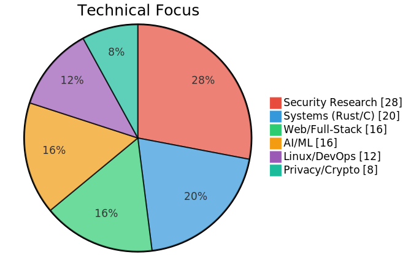

# John Zachary Fitch
**Full-Stack Engineer** | **Security Researcher** | **UC Berkeley Mathematics**

 [LinkedIn](https://www.linkedin.com/in/john-fitch-600726193/) |  [DefinitelyNot.ai](https://definitelynot.ai) |  webmaster@internetuniverse.org

---

Software engineer with UC Berkeley mathematics background specializing in systems programming, security research, and AI/ML applications. I build production tools across the full stack—from WebGPU-accelerated browser applications to Rust CLI tools to bare-metal NixOS infrastructure.

**What I ship:**
- **[Observatory](https://look.definitelynot.ai)** - WebGPU deepfake detection running 4 ML models in-browser *(live demo)*
- **[specHO](https://github.com/johnzfitch/specHO)** - LLM watermark detection via phonetic/semantic analysis *(The Echo Rule)*
- **[filearchy](https://github.com/johnzfitch/filearchy)** - COSMIC Files fork with sub-10ms trigram search *(Rust)*
- **[nautilus-plus](https://github.com/johnzfitch/nautilus-plus)** - Enhanced GNOME Files with sub-millisecond search *(AUR)*
- **[indepacer](https://github.com/johnzfitch/indepacer)** - PACER CLI for federal court research *(PyPI: pacersdk)*

Self-hosting 32GB bare-metal infrastructure (NixOS) with post-quantum cryptography (ML-KEM, Rosenpass VPN), authoritative DNS, and containerized services.

**Philosophy:** AI as augmentation, not replacement. Privacy by default. Ship tools that make people better at their jobs.

---

##  Featured

###  Observatory - WebGPU Deepfake Detection
**Live Demo:** [look.definitelynot.ai](https://look.definitelynot.ai)

Browser-based AI image detection running 4 specialized ML models (ViT, Swin Transformer) through WebGPU. Zero server-side processing—all inference happens client-side with 672MB of ONNX models.

| Model | Accuracy | Architecture |
|-------|----------|--------------|
| dima806_ai_real | 98.2% | Vision Transformer |
| SMOGY | 98.2% | Swin Transformer |
| Deep-Fake-Detector-v2 | 92.1% | ViT-Base |
| umm_maybe | 94.2% | Vision Transformer |

**Stack:** JavaScript (ES6), Transformers.js, ONNX, WebGPU/WASM
**Design:** 2006 "Purist" UI aesthetic - no frameworks, pure web standards

---

###  indepacer - Federal Court Records CLI
PACER automation for legal research with MFA support, local caching, and intelligent document linking.

```bash
pacer pcl cases -t "Apple v. Samsung"         # Search cases nationwide
pacer download docket 1:18-cv-08434 nysd      # Download full docket
pacer grep "motion to dismiss"                # Search local archive
```

Features context system for workflow efficiency, cost confirmation prompts (PACER charges per page), and batch operations. Separate `pacersdk` SDK published to PyPI.

**Stack:** Python, Click, Rich terminal UI, TOTP authentication

---

###  aegis - Intelligent Browser Security
Browser automation with risk-based safety controls, human behavior simulation for anti-bot detection, and container isolation for privacy.

**Danger Slider:** 5-level control from PARANOID (approve every action) to AUTOPILOT (time-limited auto-approve). Cursor movements use Bezier curves and Fitts's Law for realistic timing.

**Stack:** TypeScript, Playwright, Firefox/Floorp integration, WebSocket MCP

---

###  The Echo Rule - LLM Detection Methodology
LLMs echo their training data. That echo is detectable through pattern recognition:

| Signature | Detection Method |
|-----------|------------------|
| **Phonetic** | CMU phoneme analysis, Levenshtein distance |
| **Structural** | POS tag patterns, sentence construction |
| **Semantic** | Word2Vec cosine similarity, hedging clusters |

Implemented in [specHO](https://github.com/johnzfitch/specHO) with 98.6% preprocessor test pass rate. Live demo at [definitelynot.ai](https://definitelynot.ai).

---

##  Skills

<picture>
  <source media="(prefers-color-scheme: dark)" srcset=".github/assets/charts/skills-dark.svg">
  <source media="(prefers-color-scheme: light)" srcset=".github/assets/charts/skills-light.svg">
  
</picture>

---

##  Projects

###  AI/ML

| Project | Description | Stack |
|---------|-------------|-------|
| [**observatory**](https://github.com/johnzfitch/observatory) | WebGPU-accelerated deepfake detection with 4 ML models running client-side. Live at [look.definitelynot.ai](https://look.definitelynot.ai). | JavaScript, Transformers.js, ONNX |
| [**specHO**](https://github.com/johnzfitch/specHO) | LLM watermark detection implementing the Echo Rule through phonetic, structural, and semantic analysis. | Python, spaCy, Gensim |
| [**definitelynot.ai**](https://github.com/johnzfitch/definitelynot.ai) | Unicode security sanitizer defending against Trojan Source attacks, homoglyph spoofing, and BiDi exploits. | PHP, JavaScript, ICU |
| [**marginium**](https://github.com/johnzfitch/marginium) | Multimodal generation framework providing LLMs with visual awareness of their output structure. | Python |
| [**gemini-cli**](https://github.com/johnzfitch/gemini-cli) | Privacy-enhanced fork of Google's Gemini CLI with telemetry disabled and custom Gogh color schemes. | TypeScript, Node.js |

###  Security Research

| Project | Description | Stack |
|---------|-------------|-------|
| **aegis** *(private)* | Browser security with AI automation, anti-bot detection (Bezier curves, Fitts's Law), and container isolation. | TypeScript, Playwright |
| **eero** *(private)* | Mesh WiFi router security analysis with API enumeration, traffic capture, and HackerOne disclosure prep. | Python, Wireshark |
| **blizzarchy** *(private)* | Battle.net launcher OAuth analysis and telemetry investigation with binary reverse engineering. | Rust, Python, Ghidra |
| [**featherarchy**](https://github.com/johnzfitch/featherarchy) | Security-hardened Monero wallet fork with memory leak fixes and input validation improvements. | C++, Qt6 |
| **alienware-monitor** *(private)* | Dell monitor firmware reverse engineering with GSFW decoder/encoder and BMP extraction. | Python, Ghidra |
| **proxyforge** *(private)* | Transparent MITM proxy for API traffic analysis with TLS interception and HAR export. | Python, mitmproxy |

###  Systems Programming

| Project | Description | Stack |
|---------|-------------|-------|
| [**filearchy**](https://github.com/johnzfitch/filearchy) | COSMIC Files fork with embedded trigram search engine | Rust, libcosmic |
| ↳ [triglyph](https://github.com/johnzfitch/triglyph) | Zero-RSS trigram index library (mmap, ~0 bytes resident) | Rust, memmap2 |
| ↳ [triglyphd](https://github.com/johnzfitch/triglyphd) | D-Bus daemon for system-wide search | Rust, zbus |
| [**nautilus-plus**](https://github.com/johnzfitch/nautilus-plus) | Enhanced GNOME Files with 512px thumbnails, search-cache | C, GTK4 |
| ↳ [search-cache](https://github.com/johnzfitch/search-cache) | HashMap-based file indexing, sub-ms search for 2.15M+ files | Rust, DashMap |
| [**cod3x**](https://github.com/johnzfitch/cod3x) | Terminal coding agent with 3D ASCII interface at 60fps | Rust, SQLite |
| **bitmail** *(private)* | Modern Bitmessage client with Python CLI and Rust TUI | Python, Rust |

###  CLI Tools

| Project | Description | Stack |
|---------|-------------|-------|
| [**indepacer**](https://github.com/johnzfitch/indepacer) | PACER CLI for federal court research with nationwide search, MFA support, and cost protection. | Python, Click, Rich |
| [**iconics**](https://github.com/johnzfitch/iconics) | Semantic icon library with 3,372 PNGs, CLI tool for discovery/export, and project-aware suggestions. | Python |
| [**gemini-sharp**](https://github.com/johnzfitch/gemini-sharp) | Single-file standalone Gemini CLI binaries with privacy enhancements and 15+ Gogh color themes. | C#, .NET |

###  Desktop/Linux

| Project | Description | Stack |
|---------|-------------|-------|
| [**omarchy**](https://github.com/johnzfitch/omarchy) | Custom fork of DHH's omarchy with 2,628+ lines: waybar RSS ticker, NVIDIA config, ultra-compact UI. | Hyprland, Shell |
| [**waybar-config**](https://github.com/johnzfitch/waybar-config) | RSS feed ticker connecting to self-hosted FreshRSS with hover-pause and smart click routing. | JSON, CSS, Shell |
| [**claude-desktop-arch**](https://github.com/johnzfitch/claude-desktop-arch) | Enable Claude Code preview in Claude Desktop on Arch Linux via 3-line platform detection patch. | JavaScript, Shell |
| [**qualcomm-x870e-linux-bug-patch**](https://github.com/johnzfitch/qualcomm-x870e-linux-bug-patch) | WiFi 7 firmware fix for Qualcomm WCN7850 on Gigabyte X870E motherboards with pacman hook. | Python, ACPI |
| [**arch-dependency-matrices**](https://github.com/johnzfitch/arch-dependency-matrices) | Mathematical analysis of 1,553 Arch packages using graph theory, PageRank, and spectral analysis. | Python, NumPy |

###  Web/Mobile

| Project | Description | Stack |
|---------|-------------|-------|
| [**NetworkBatcher**](https://github.com/johnzfitch/NetworkBatcher) | Energy-efficient network request batching for iOS 26+ with intelligent coalescing. | Swift |
| [**stranger-things-finale-theater-list**](https://github.com/johnzfitch/stranger-things-finale-theater-list) | Complete list of 490 theaters showing Stranger Things 5: The Finale (Dec 31, 2025 & Jan 1, 2026). | Markdown |
| [**Liberty-Links**](https://github.com/johnzfitch/Liberty-Links) | Tracker-free, redirect-free links - privacy-respecting alternatives to common services. | Markdown |

---

##  Infrastructure

**Primary Server:** Intel Xeon E3-1270v5 | 32GB RAM | 3.6TB SSD (btrfs) | NixOS 24.05

| Service | Technology |
|---------|------------|
| **Security** | Post-quantum SSH (sntrup761x25519), Rosenpass VPN (ML-KEM + Kyber-512), nftables firewall |
| **DNS** | Unbound recursive resolver with DNSSEC, ad/tracker blocking, no third-party DNS |
| **Services** | FreshRSS, Caddy (HTTPS/HTTP3), cPanel/WHM, Podman containers |
| **Network** | Local 10Gbps, authoritative BIND9 with RFC2136 ACME |

**Infrastructure as Code:**

| Project | Description | Stack |
|---------|-------------|-------|
| **NixOS Server** *(private)* | Bare-metal config with post-quantum SSH (ML-KEM), Rosenpass VPN, authoritative DNS (BIND9), and containerized services. | Nix, agenix |
| **unbound-config** *(private)* | Recursive DNS with DNSSEC, QNAME minimization, and ad/tracker blocking (Steven Black, OISD, Hagezi Pro). | Unbound, Shell |

---

##  Philosophy

AI should expand human capability, not replace workers. I call it **additive innovation**: build tools that make people better at their jobs, not tools that eliminate their jobs.

The best way to predict AI's impact is to build the tools that shape it.

---

<p align="center">
<sub>SF Bay Area · Open to remote · Icons from <a href="https://github.com/johnzfitch/iconics">iconics</a></sub>
</p>
