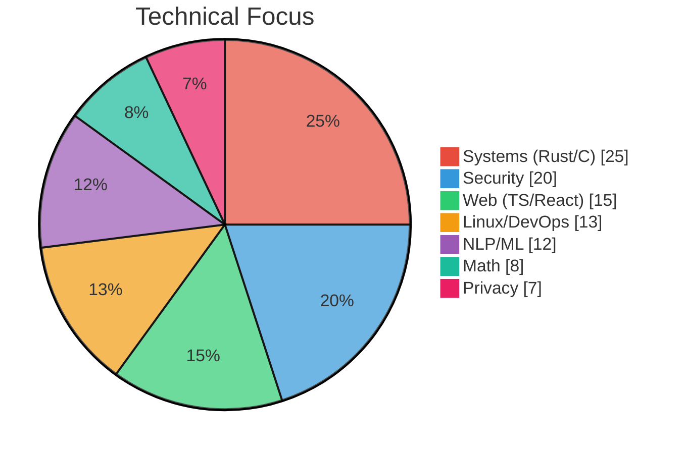

# John Zachary Fitch

 **AI Product Engineer** |  **UC Berkeley Mathematics**

---

I'm a software engineer with a background in mathematics from UC Berkeley, focused on AI product engineering and privacy-first infrastructure. My work centers on building tools that expand human capability rather than replace it—what I call **additive innovation**.

I maintain a [custom fork of omarchy](https://github.com/johnzfitch/omarchy) with 2,600+ lines of modifications tailored to my workflow. My [nautilus-fork](https://github.com/johnzfitch/nautilus-fork) integrates with [search-cache](https://github.com/johnzfitch/search-cache), a Rust-based file search tool, to enhance GTK4 file management. I'm developing **The Echo Rule**—a methodology for detecting LLM-generated text through phonetic, structural, and semantic pattern recognition, implemented in [specHO](https://github.com/johnzfitch/specHO) and [definitelynot.ai](https://definitelynot.ai).

I run self-hosted infrastructure including a NixOS bare-metal server with post-quantum SSH, plus cPanel/WHM hosting. My setup includes Unbound recursive DNS with DNSSEC and ad-blocking, and self-hosted FreshRSS powering a custom waybar ticker.

**Philosophy:** Local-first computing. Privacy by default. AI as augmentation, not replacement.

---

##  The Echo Rule

LLMs echo their training data. That echo is detectable through pattern recognition:

| Signature | Detection Method |
|-----------|------------------|
| **Phonetic** | CMU phoneme analysis, Levenshtein distance on pronunciation |
| **Structural** | POS tag patterns, sentence construction habits |
| **Semantic** | Word2Vec cosine similarity, hedging language clusters |

---

##  Skills

---

##  Projects

###  AI/ML

| Project | Description | Stack |
|---------|-------------|-------|
| [**specHO**](https://github.com/johnzfitch/specHO) | LLM watermark detection implementing the Echo Rule through phonetic, structural, and semantic analysis. Five-component pipeline. | Python, spaCy, Gensim |
| [**definitelynot.ai**](https://github.com/johnzfitch/definitelynot.ai) | Unicode security sanitizer defending against Trojan Source attacks, homoglyph spoofing, and BiDi exploits via 16-step pipeline. | PHP, JavaScript, ICU |
| [**marginium**](https://github.com/johnzfitch/marginium) | Multimodal generation framework providing LLMs with visual awareness of their output structure. | Python |
| [**gemini-cli**](https://github.com/johnzfitch/gemini-cli) | Privacy-enhanced fork of Google's Gemini CLI with telemetry disabled and custom Gogh color schemes. | TypeScript, Node.js |

###  Systems

| Project | Description | Stack |
|---------|-------------|-------|
| [**search-cache**](https://github.com/johnzfitch/search-cache) | Fast file search tool using HashMap-based indexing with DashMap for concurrency and Rayon for parallel execution. | Rust |
| [**nautilus-fork**](https://github.com/johnzfitch/nautilus-fork) | GNOME Files v50.alpha fork integrating with search-cache via C wrapper. Includes animated thumbnail infrastructure. | C, GTK4 |
| [**cod3x**](https://github.com/johnzfitch/cod3x) | Terminal coding agent with 3D ASCII interface at 60fps and SQLite session persistence. | Rust, SQLite |

###  Desktop

| Project | Description | Stack |
|---------|-------------|-------|
| [**omarchy**](https://github.com/johnzfitch/omarchy) | Custom fork of DHH's omarchy with 2,628+ lines of customization: waybar RSS ticker, NVIDIA config, ultra-compact Nautilus UI. | Hyprland, Shell |
| [**waybar-config**](https://github.com/johnzfitch/waybar-config) | RSS feed ticker connecting to self-hosted FreshRSS with hover-pause and smart click routing. | JSON, CSS, Shell |
| [**iconics**](https://github.com/johnzfitch/iconics) | Semantic icon library with 3,372 cataloged PNG icons and CLI tool for discovery and export. | Python |
| [**claude-desktop-arch**](https://github.com/johnzfitch/claude-desktop-arch) | Enable Claude Code preview in Claude Desktop on Arch Linux via 3-line platform detection patch. | JavaScript, Shell |
| [**gemini-sharp**](https://github.com/johnzfitch/gemini-sharp) | Single-file standalone Gemini CLI binaries with privacy enhancements and 15+ Gogh color themes. | C#, .NET |

###  Other

| Project | Description | Stack |
|---------|-------------|-------|
| [**qualcomm-x870e-linux-bug-patch**](https://github.com/johnzfitch/qualcomm-x870e-linux-bug-patch) | ACPI kernel fix for Qualcomm WCN7850 WiFi 7 on AMD X870E motherboards. | ACPI, Shell |
| [**arch-dependency-matrices**](https://github.com/johnzfitch/arch-dependency-matrices) | Mathematical analysis of 1,553 Arch Linux packages using graph theory, PageRank, and spectral analysis. | Python, NumPy |
| [**stranger-things-finale-theater-list**](https://github.com/johnzfitch/stranger-things-finale-theater-list) | Complete list of 490 theaters showing Stranger Things 5: The Finale (Dec 31, 2025 & Jan 1, 2026). | Markdown |

---

##  Infrastructure

### Primary Server (Tier.net - Dallas, TX)

| Component | Specification |
|-----------|---------------|
| CPU | Intel Xeon E3-1270v5 |
| Memory | 32GB RAM |
| Storage | 2x 1.8TB SSD (3.6TB total, btrfs) |
| OS | NixOS 24.05 |
| Security | Post-quantum SSH (sntrup761x25519), nftables |

###  DNS

- **Unbound** recursive resolver - no third-party DNS
- DNSSEC validation, QNAME minimization
- Ad/tracker blocking (Steven Black, OISD, Hagezi Pro)

###  Self-Hosted

- **FreshRSS** at feed.internetuniverse.org (desktop integration)
- **Caddy** with automatic HTTPS/HTTP3
- **cPanel/WHM** for InternetUniverse.org and DefinitelyNot.ai

---

##  Philosophy

AI should expand human capability, not replace workers. I call it **additive innovation**: build tools that make people better at their jobs, not tools that eliminate their jobs.

The best way to predict AI's impact is to build the tools that shape it.

---

##  Contact

**Location:** SF Bay Area or remote

**Email:** webmaster@internetuniverse.org

---

Icons curated by Master Orchestrator Agent from the [iconics](https://github.com/johnzfitch/iconics) library (3,372+ semantic icons). Multi-agent fact-checking ensured accuracy.
