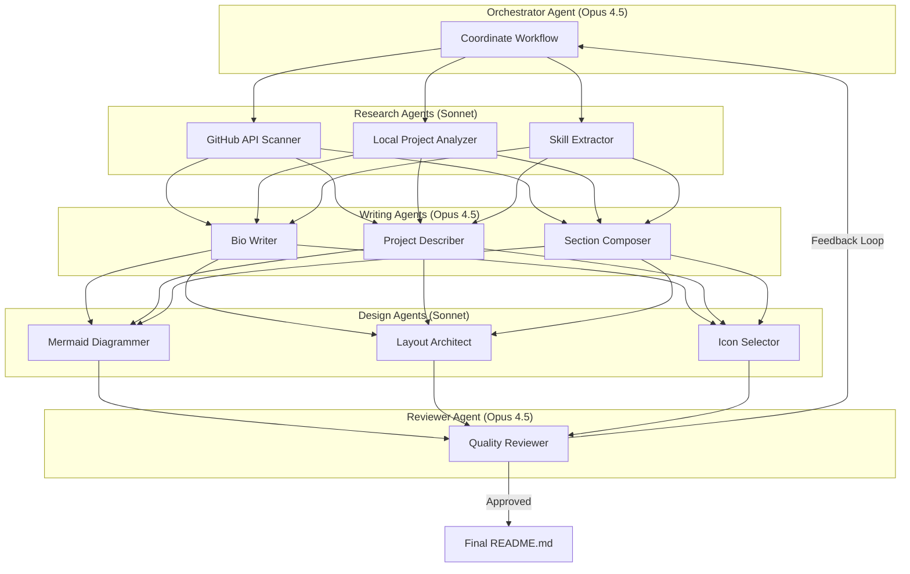

# Multi-Agent Resume Orchestration Plan

## Architecture Overview

## Agent Definitions

### 1. Orchestrator Agent (Opus 4.5)
- **Role**: Central coordinator
- **Tasks**: Dispatch work, collect results, manage iteration loops
- **Output**: Coordination state, agent assignments

### 2. Research Agents (Sonnet 4.5)

#### GitHub API Scanner
- Fetch all public repos with descriptions
- Extract languages, topics, stars
- Identify flagship projects

#### Local Project Analyzer
- Scan ~/dev/ for unreleased projects
- Determine project maturity/appropriateness
- Extract README summaries

#### Skill Extractor
- Aggregate technologies across all projects
- Categorize: Languages, Frameworks, Tools, Domains
- Create skill proficiency indicators

### 3. Writing Agents (Opus 4.5)

#### Bio Writer
- Craft professional summary
- Highlight unique value proposition
- Match tone to target audience

#### Project Describer
- Write compelling project descriptions
- Focus on impact and innovation
- Link to relevant repos

#### Section Composer
- Structure resume sections logically
- Create smooth narrative flow
- Ensure consistency

### 4. Design Agents (Sonnet 4.5)

#### Mermaid Diagrammer
- Create skill visualization charts
- Build project relationship graphs
- Design career timeline

#### Layout Architect
- Structure for GitHub desktop/mobile
- Optimize table layouts
- Ensure responsive design

#### Icon Selector
- Choose semantic 16x16 icons from iconics
- Prioritize gemini-upscaled versions
- Generate markdown snippets

### 5. Reviewer Agent (Opus 4.5)
- **Role**: Quality assurance with feedback loop
- **Criteria**:
  - Professional tone
  - Technical accuracy
  - Visual appeal
  - Mobile compatibility
  - Icon semantic correctness
- **Output**: Approval or specific revision requests back to Orchestrator

## Project Categories to Include

### Public Projects (from GitHub)
1. **AI/ML Detection** - specHO, definitelynot.ai, marginium
2. **Developer Tools** - cod3x, gemini-sharp, iconics
3. **Linux/System** - omarchy, claude-desktop-arch, qualcomm patch
4. **Security Research** - (appropriate public items)
5. **Infrastructure** - waybar-config, nautilus-fork
6. **Visualization** - wealth-for-me-not-for-thee, arch-dependency-matrices

### Private/Unreleased (curated for appropriateness)
1. **Browser Automation** - aegis (MCP server)
2. **Medical Tech Research** - omega-pod (educational)
3. **Networking** - eero research, unbound-config
4. **E-commerce** - tbdliquids (if appropriate)

## Icon Selection Strategy

### Priority: 16x16 Gemini-Upscaled Icons
Location: `/home/zack/dev/iconics/raw/*_16x16.png`

### Semantic Mappings
| Section | Icon Name | Rationale |
|---------|-----------|-----------|
| AI/ML | brain, robot | Intelligence, automation |
| Security | shield, lock | Protection, privacy |
| Development | console, code | Programming, tools |
| Network | network, globe | Infrastructure, web |
| Linux | terminal, application | System, apps |
| Research | search, microscope | Investigation, analysis |

## Mermaid Compatibility Notes

### GitHub Desktop & Mobile Requirements
- Use `flowchart` over `graph` for better mobile rendering
- Keep node text short (< 20 chars)
- Limit diagram complexity (< 15 nodes for mobile)
- Avoid custom styling that may not render
- Test with both light/dark themes

### Recommended Diagram Types
1. **Skill Radar** - pie chart for skill distribution
2. **Project Timeline** - gantt or simple flowchart
3. **Tech Stack** - hierarchical flowchart
4. **Focus Areas** - pie chart

## Execution Phases

### Phase 1: Research (Parallel)
- GitHub scanner + Local analyzer + Skill extractor
- Output: Project catalog, skill inventory

### Phase 2: Writing (Sequential)
- Bio → Project descriptions → Section composition
- Output: Draft content blocks

### Phase 3: Design (Parallel)
- Mermaid diagrams + Layout + Icons
- Output: Visual elements, icon exports

### Phase 4: Assembly
- Combine all elements into README.md
- Output: Complete draft

### Phase 5: Review Loop
- Reviewer evaluates draft
- If issues: Loop back to relevant agents
- If approved: Finalize

## Success Criteria

1. Professional appearance on GitHub.com
2. Readable on mobile GitHub app
3. All Mermaid diagrams render correctly
4. Icons display at 16x16 consistently
5. Content accurately represents skills/projects
6. No private/sensitive information exposed
7. Links all functional
